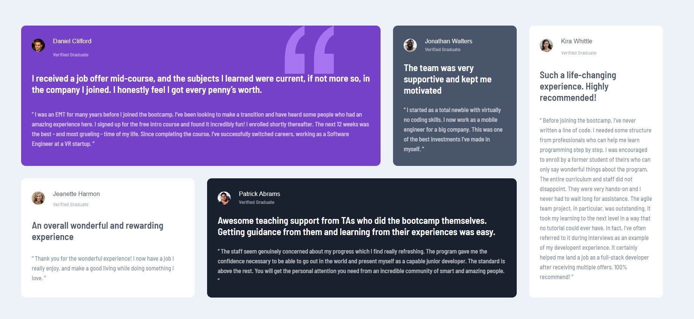

# Frontend Mentor - Testimonials grid section solution

This is a solution to the [Testimonials grid section challenge on Frontend Mentor](https://www.frontendmentor.io/challenges/testimonials-grid-section-Nnw6J7Un7). Frontend Mentor challenges help you improve your coding skills by building realistic projects. 

## Table of contents

- [Overview](#overview)
  - [The challenge](#the-challenge)
  - [Screenshot](#screenshot)
  - [Links](#links)
- [My process](#my-process)
  - [Built with](#built-with)
  - [Useful resources](#useful-resources)
- [Author](#author)

## Overview

### The challenge

Users should be able to:

- View the optimal layout for the site depending on their device's screen size

### Screenshot

Add a screenshot of your solution. The easiest way to do this is to use Firefox to view your project, right-click the page and select "Take a Screenshot". You can choose either a full-height screenshot or a cropped one based on how long the page is. If it's very long, it might be best to crop it.

Alternatively, you can use a tool like [FireShot](https://getfireshot.com/) to take the screenshot. FireShot has a free option, so you don't need to purchase it. 

Then crop/optimize/edit your image however you like, add it to your project, and update the file path in the image above.

### Links

- Solution URL: [Github](https://github.com/aldijoko/testimonials-grid)
- Live Site URL: [Live Url](https://testimonialsgridaljok.netlify.app/)

## My process

### Built with

- Semantic HTML5 markup
- CSS custom properties
- CSS Grid
- Mobile-first workflow
- [Svelte](https://kit.svelte.dev/) - JS library

### Useful resources

- [Grid](https://css-tricks.com/snippets/css/complete-guide-grid/) - This helped me for how tou understand Grid
- [Grid](https://www.w3schools.com/css/css_grid.asp) - This is an amazing article which helped me finally understand XYZ. I'd recommend it to anyone still learning this concept.

## Author

- Frontend Mentor - [@aldijoko](https://www.frontendmentor.io/profile/aldijoko)
- Twitter - [@aldijokosp](https://www.twitter.com/aldijokosp)
